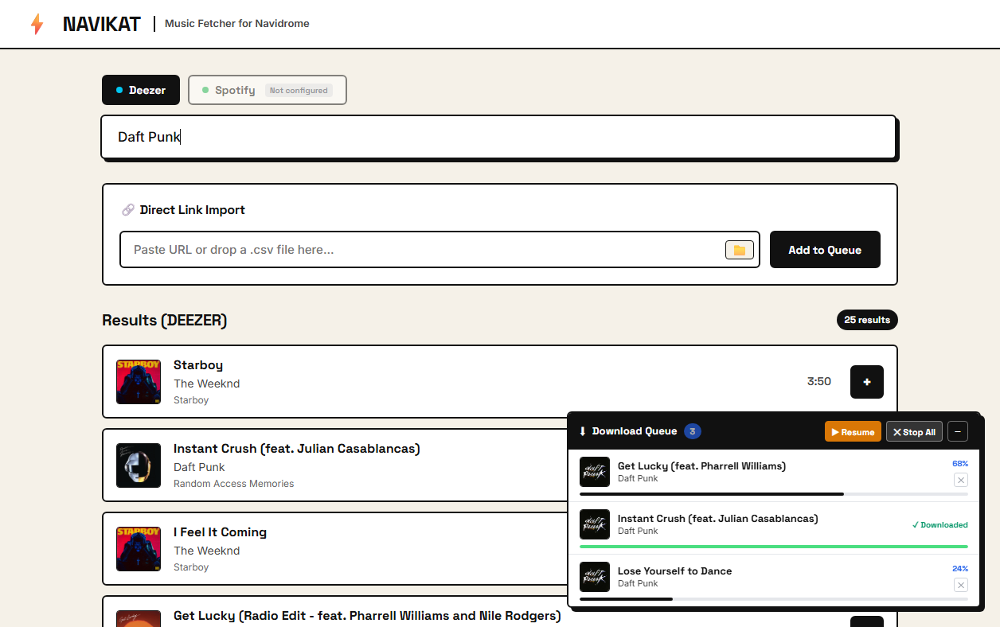
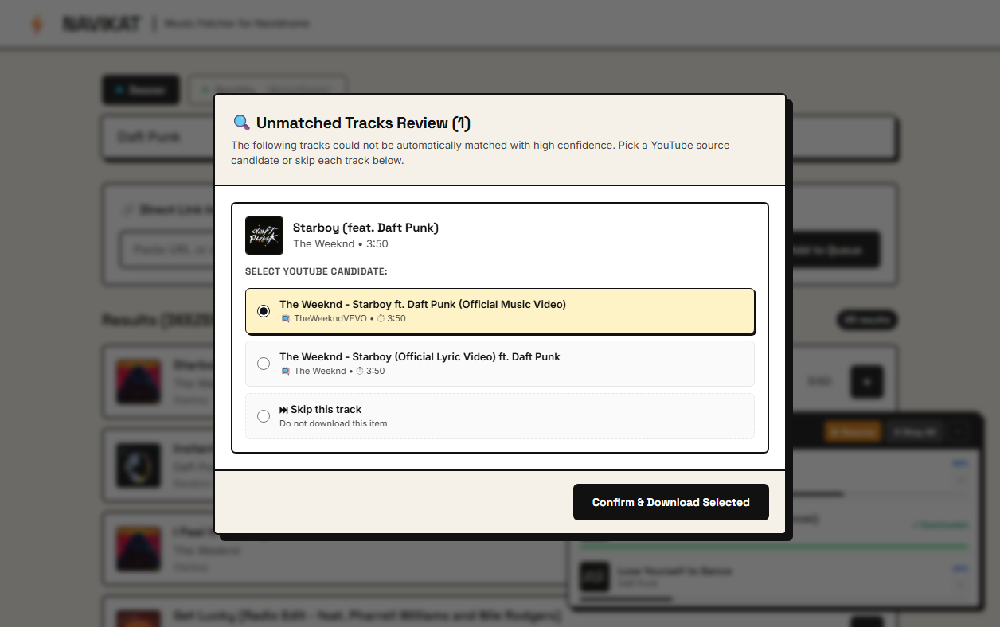

# Navikat

Navikat is a self-hosted web application that fetches music tracks and playlists from Deezer, Spotify, YouTube, and CSV exports, downloads high-quality 320kbps audio, and embeds complete metadata, HD covers, and synchronized lyrics directly into your Navidrome music library. It automatically handles file naming, organization, deduplication, and triggers a Navidrome library scan once downloads finish.

---

## 🚀 Installation

1. **Clone the repository:**
   ```bash
   git clone https://github.com/redwally/navikat.git
   cd navikat
   ```

2. **Configure environment:**
   Copy `.env.example` to `.env` and fill in your values (see [Configuration](#-configuration) below for what each variable does).
   ```bash
   cp .env.example .env
   ```

3. **Set your music library path:**
   In `.env`, set `MUSIC_HOST_PATH` to the real folder on your host machine where your music library lives — no need to edit `docker-compose.yml` at all, it already reads this variable.
   ```dotenv
   MUSIC_HOST_PATH=/path/to/your/actual/music/folder
   ```

4. **Start the container:**
   ```bash
   docker compose up -d --build
   ```

5. **Open Navikat:**
   Navigate to `http://localhost:<HOST_PORT>` (default [http://localhost:3000](http://localhost:3000)) in your web browser.

---

## ⚙️ Configuration

All configuration lives in `.env`:

| Variable | Required | Description |
|---|---|---|
| `HOST_PORT` | No | Port exposed on your host machine (default `3000`). Change this if the port is already taken. |
| `MUSIC_LIBRARY_PATH` | No | Internal container path for the music library. Leave as `/music` — don't change this. |
| `MUSIC_HOST_PATH` | Yes | Real path on your host machine to your Navidrome music folder. This is what actually gets mounted into the container. |
| `MAX_CONCURRENT_DOWNLOADS` | No | How many downloads run in parallel (default `3`). |
| `SPOTIFY_CLIENT_ID` / `SPOTIFY_CLIENT_SECRET` | No | Needed only to enable Spotify search/import. Get them from the [Spotify Developer Dashboard](https://developer.spotify.com/dashboard). |
| `ENABLE_AUTH` | No | Set to `true` to password-protect the site (default `false`). |
| `AUTH_PASSWORD` | If `ENABLE_AUTH=true` | The login password. |
| `SESSION_SECRET` | If `ENABLE_AUTH=true` | Random secret string used to sign session cookies — change it from the default. |
| `NAVIDROME_URL` / `NAVIDROME_USER` / `NAVIDROME_PASSWORD` | No | Optional — enables automatic library rescan and playlist creation in Navidrome after downloads finish. |
| `DEBUG` | No | Set to `true` for verbose logging (default `false`). |

---

## 📥 Import Methods

- **Search:** Use the main search bar to search across millions of tracks on Deezer (or Spotify when configured). Click the `+` button on any track result to fetch metadata, lyrics, and start downloading immediately.
- **YouTube Link:** Paste a direct YouTube video URL into the direct import field to download that specific audio stream. Navikat automatically cleans video titles, fetches matched HD covers and metadata, and embeds synchronized lyrics.
- **Playlist Link:** Paste a Deezer, Spotify, or YouTube playlist/album URL into the import box to batch-enqueue every track in the playlist with concurrent download management and deduplication against your library.
- **CSV Import:** Drag and drop a `.csv` playlist export (from TuneMyMusic, Spotify, or Deezer) directly onto the import input area or click the 📁 button to browse. Navikat parses the tracks, prioritizes exact platform IDs and ISRC codes, and enqueues all matched songs automatically.

---

## 🎛️ Queue Panel & Review

The collapsible corner download queue displays real-time progress bars, track metadata, and current status for all active and pending downloads. You can pause or resume the queue at any time, cancel individual jobs, or stop all downloads with one click. If a track's audio match fails confidence thresholds during a batch import, a brutalist review modal lets you pick from top YouTube candidates or skip the track. When a playlist import completes, an in-queue confirmation card allows you to create a matching playlist in Navidrome with a single click.

---

## 📸 Screenshots

### Main Interface & Search


### Download Queue Panel


### Unmatched Tracks Review Modal


### Minimalist Login


---

## 📄 License

MIT — see [LICENSE](LICENSE).

Note: Navikat is intended for personal/fair use. Downloading copyrighted music without authorization may violate YouTube's Terms of Service and copyright law in your jurisdiction — use responsibly.